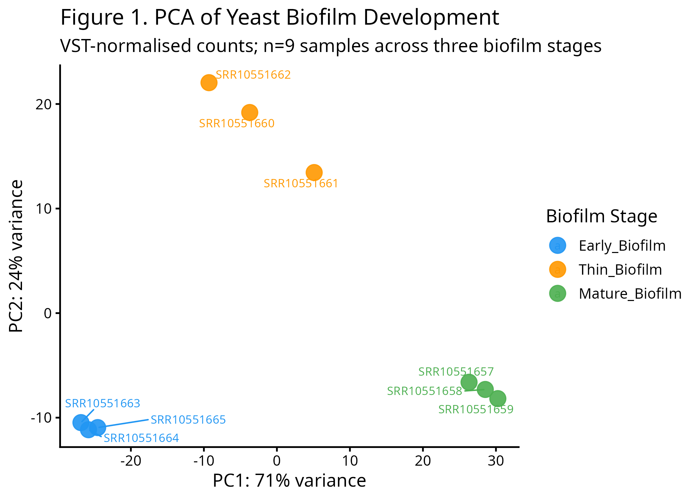
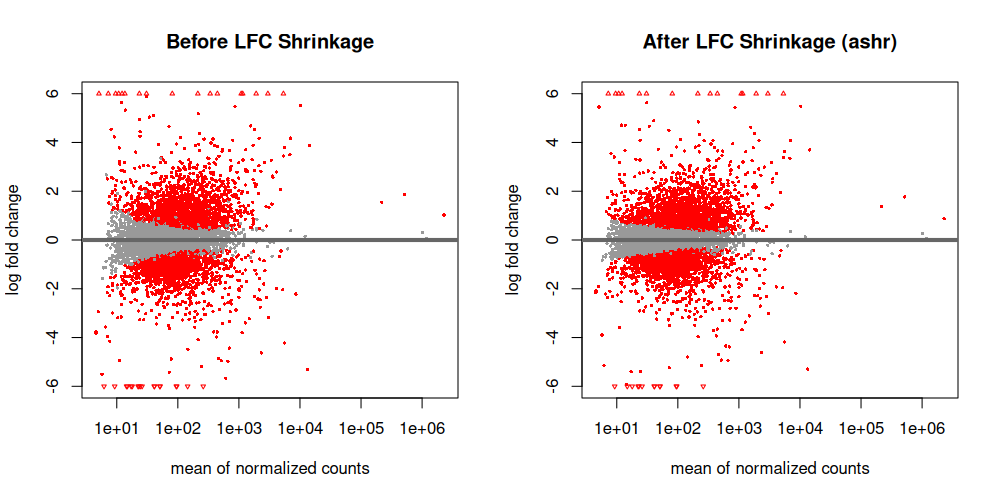
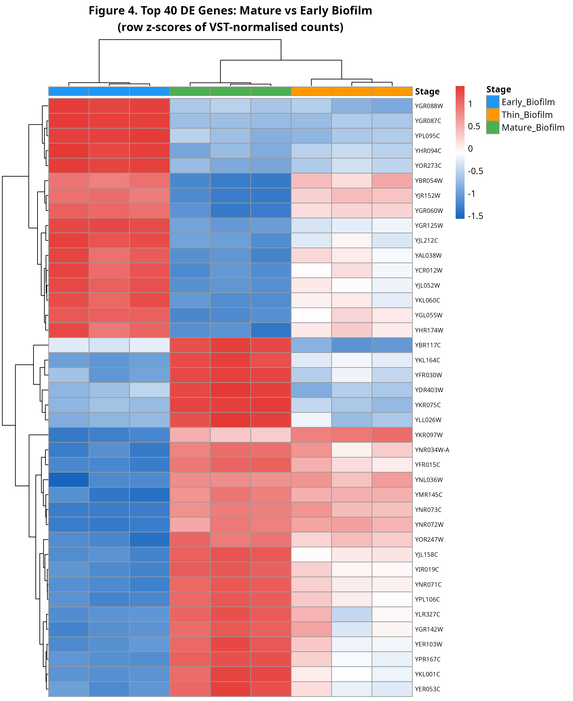
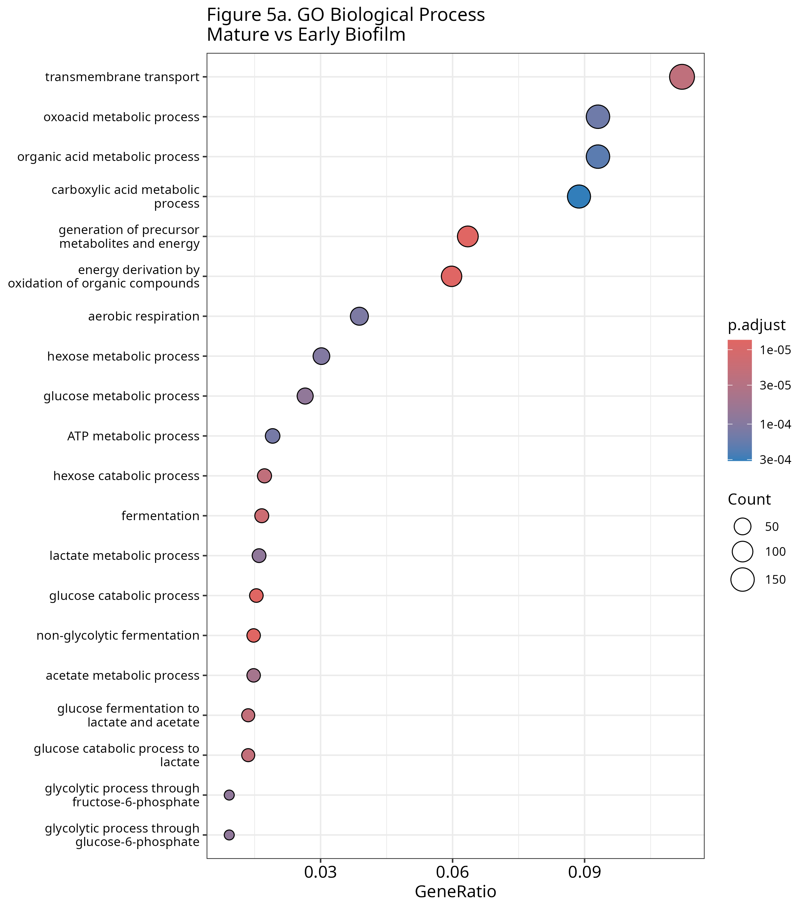
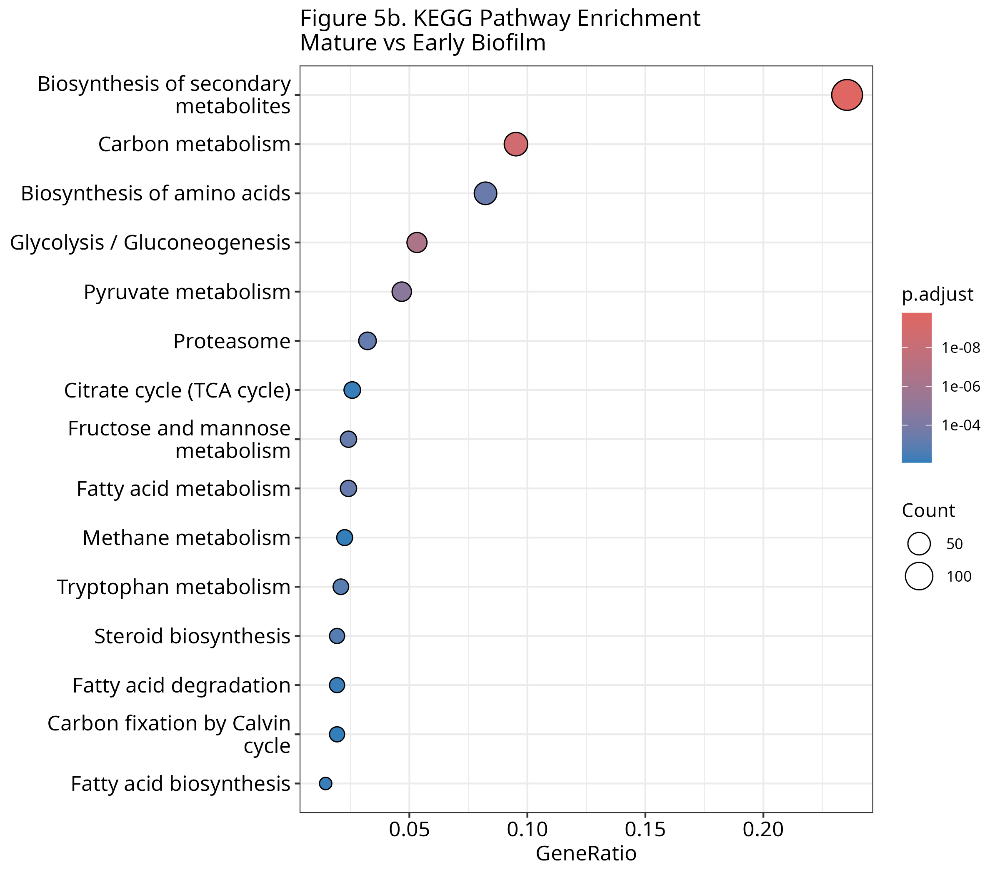
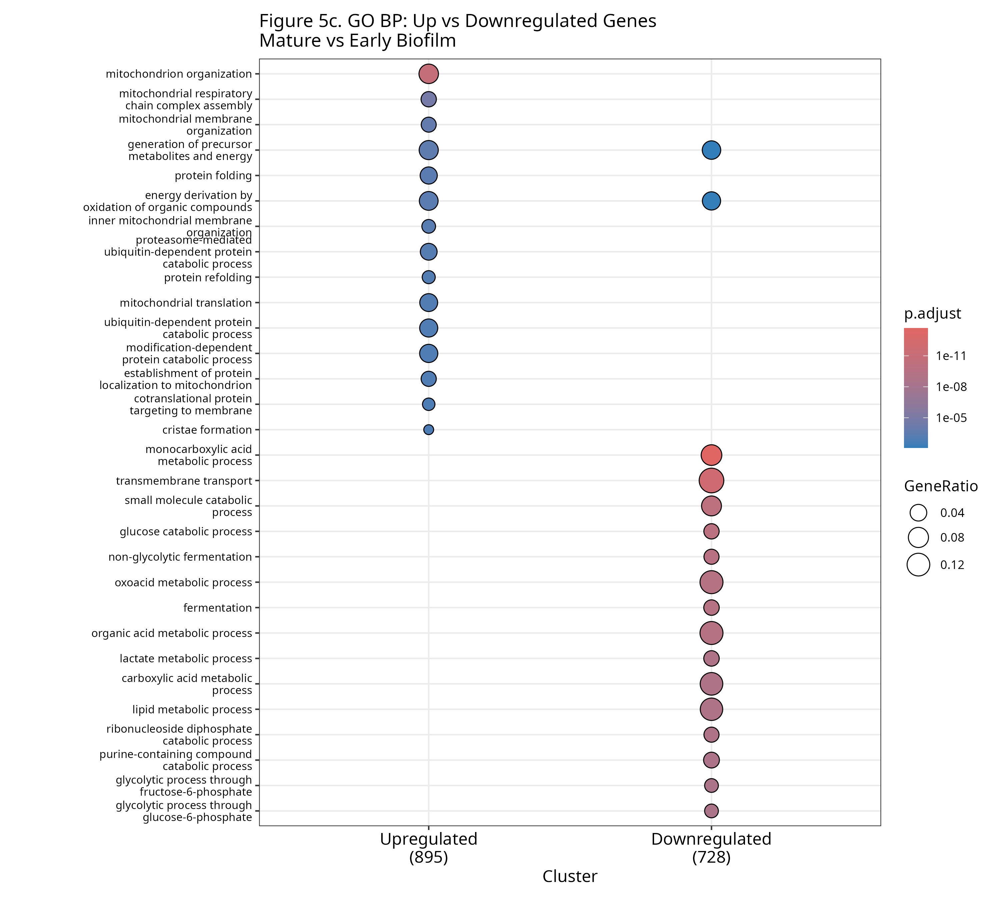

# Yeast Biofilm RNA-seq Analysis
Arwa Sheheryar  
BINF6110 – Assignment 2
---
## Introduction

Biofilms are structured microbial communities encased in a self-produced extracellular matrix that confer coordinated resistance to environmental stressors, including antimicrobials and ethanol (Yang et al., 2018). Their formation has broad medical and industrial relevance. In clinical settings, biofilm-associated tolerance contributes to persistent infections, while in fermentation contexts, biofilm development influences community stability and metabolic output (Yang et al., 2018). In Saccharomyces cerevisiae, biofilm formation, including the velum that develops on the surface of aging wine, is largely governed by the FLO gene family, which differentially regulates cell–cell and cell–surface adhesion and makes yeast a strong genetic model for studying adhesion-mediated community behavior (Bester et al., 2006; Yang et al., 2018). Biofilm maturation represents a biologically distinct phase characterized by increased structural complexity and dynamic remodeling of gene expression, reflecting adaptive responses to changing chemical and nutritional conditions over time (Yang et al., 2018).

RNA-seq is particularly well suited for examining these transcriptional dynamics because it enables unbiased, genome-wide quantification of transcript abundance without relying on pre-designed probes (Nookaew et al., 2012). Compared to microarray platforms, RNA-seq offers a substantially broader dynamic range, allowing more accurate measurement of both low- and high-abundance transcripts and detecting a greater number of differentially expressed genes with larger fold changes in S. cerevisiae datasets (Nookaew et al., 2012; Zhao et al., 2014). Its sensitivity to rare and transient transcripts, including cryptic RNAs and alternative isoforms that often fall below array detection thresholds, strengthens its ability to capture the full transcriptional complexity of yeast biofilms (Zhao et al., 2014). Because RNA-seq avoids cross-hybridization artifacts, probe saturation, and fixed annotation constraints inherent to microarrays, it also provides improved statistical power for detecting differential expression among lowly expressed and downregulated genes when paired with count-based modeling frameworks (Nookaew et al., 2012).

While differential expression analysis identifies individual genes that change significantly between conditions, gene lists alone offer limited mechanistic insight without contextualization into coordinated biological functions (Reimand et al., 2019). Over-representation analysis (ORA) addresses this by statistically testing whether predefined biological categories from Gene Ontology (GO) or KEGG pathway databases are enriched among a threshold-defined set of significant genes relative to an appropriate background, typically using Fisher’s exact test (Reimand et al., 2019; Ziemann et al., 2024). ORA is appropriate when using a predefined significance threshold and aims to identify over-represented biological processes among significantly differentially expressed genes, whereas GSEA evaluates ranked gene lists without arbitrary cutoffs and detects coordinated but subtle shifts across all genes (Reimand et al., 2019; Yoon et al., 2016). ORA was selected here because this study focused on a rigorously defined DE gene set derived from stringent statistical modeling, enabling clear biological interpretation while maintaining transparency in background specification and multiple-testing correction (Ziemann et al., 2024).

This study reanalyzes publicly available RNA-seq data from Mardanov et al. (2020) to characterize transcriptional differences across three stages of yeast velum biofilm development: early, thin, and mature, sampled at 38, 83, and 109 days post-inoculation, respectively. Differential expression was performed using DESeq2, which applies a negative binomial model with regularized log fold change shrinkage to appropriately model overdispersion and limited replicate sizes typical of RNA-seq experiments (Love et al., 2014). Functional enrichment using GO biological process and KEGG pathway ORA was then applied to identify biological processes associated with biofilm progression.

---
## Methods

### Data Acquisition:

Raw RNA-seq data were obtained from the NCBI Sequence Read Archive under BioProject accession PRJNA592304 (Mardanov et al., 2020). The dataset comprises nine single-end bulk RNA-seq libraries representing three stages of yeast velum biofilm development: Early Biofilm (IL20–IL22; Day 38), Thin Biofilm (IL23–IL25; Day 83), and Mature Biofilm (IL29–IL31; Day 109), with three biological replicates per stage. Raw reads were downloaded using SRA Toolkit v3.2.1 (fasterq-dump --split-files).

### Quality Control:

Read quality was assessed using FastQC v0.12.1 (Andrews, 2010). All nine samples passed quality thresholds with no adapter contamination detected; trimming was therefore not performed, consistent with recommendations for pseudoalignment-based quantification pipelines (Patro et al., 2017).

### Reference and Quantification:

The Saccharomyces cerevisiae R64 reference transcriptome and genome (GCF_000146045.2) were downloaded from NCBI. A decoy-aware Salmon index was constructed using the full genome sequence as a decoy to prevent spurious mapping of genomic reads to the transcriptome (Patro et al., 2017). Transcript-level quantification was performed using Salmon v1.10.3 with automatic library type detection (-l A), mapping validation (--validateMappings), and GC bias correction (--gcBias). All libraries were processed as single-end reads.

### Differential Expression Analysis:

Transcript-level counts were imported and summarized to gene level using tximport v1.38.2 (Soneson et al., 2015), with a transcript-to-gene mapping table derived from the R64 GTF annotation using txdbmaker. Differential expression analysis was performed in R v4.5.1 using DESeq2 v1.50.2 (Love et al., 2014). A design formula of ~stage was specified, with Early Biofilm set as the reference group. Genes with fewer than 10 counts in fewer than three samples were removed prior to analysis. Three pairwise comparisons were performed: Thin Biofilm vs Early Biofilm, Mature Biofilm vs Early Biofilm, and Mature Biofilm vs Thin Biofilm. Log2 fold changes were regularized using adaptive shrinkage (ashr; Stephens, 2017) to reduce noise from low-count genes. Genes were considered significantly differentially expressed at a Benjamini-Hochberg adjusted p-value < 0.05 and |log2 fold change| > 1. File paths were managed using the here package v1.0.2 to ensure cross-platform reproducibility.

### Functional Annotation:

Over-representation analysis (ORA) was performed using clusterProfiler v4.18.4 (Yu et al., 2012) with the S. cerevisiae annotation database org.Sc.sgd.db v3.22.0. Yeast ORF identifiers were mapped to Entrez Gene IDs using bitr(). GO Biological Process enrichment was tested for the full set of significant DE genes, as well as separately for upregulated and downregulated subsets using compareCluster(). KEGG pathway enrichment was performed using enrichKEGG() with organism code "sce". For all ORA analyses, the background set comprised all genes detected after pre-filtering, Benjamini-Hochberg correction was applied, and significance thresholds of p-adjusted < 0.05 and q-value < 0.2 were used.

---
## Results

### Data Quality and Overall Transcriptional Structure

Quality assessment using FastQC v0.12.1 confirmed that all nine libraries met
acceptable quality thresholds, with no adapter contamination or substantial quality
degradation detected across any sample; trimming was therefore not performed.
Principal component analysis of variance-stabilized counts revealed clear
transcriptional separation among the three biofilm stages (Figure 1). PC1,
accounting for 71% of total variance, separated Early Biofilm samples from Thin
and Mature Biofilm samples, while PC2 (24% variance) further resolved the Thin
and Mature stages. Biological replicates clustered tightly within each group,
demonstrating high within-group reproducibility and confirming that biofilm
developmental stage is the dominant source of transcriptional variation in this
dataset.

**Figure 1.** Principal component analysis of VST-normalised RNA-seq counts across
nine yeast biofilm samples. Each point represents one biological replicate, coloured
by biofilm stage. PC1 (71% variance) separates Early Biofilm from later stages;
PC2 (24% variance) resolves Thin and Mature Biofilm.

MA plots comparing normalized mean expression against log2 fold change before and
after shrinkage confirmed that adaptive shrinkage (ashr) effectively reduced
inflated fold changes associated with low-count genes while preserving large,
reliable fold changes at higher expression levels (Figure 2).

**Figure 2.** MA plots showing log2 fold change versus mean normalized counts before
(left) and after (right) adaptive shrinkage (ashr) for the Mature vs Early Biofilm
comparison. Red points indicate statistically significant genes.

---

### Differential Expression Analysis

Pairwise differential expression analysis identified substantial transcriptional
remodeling across all three stage comparisons (padj < 0.05, |log2FC| > 1).
Comparing Thin Biofilm to Early Biofilm, 794 genes were differentially expressed,
of which 410 were upregulated and 384 were downregulated. The largest
transcriptional changes were observed in the Mature vs Early Biofilm comparison,
yielding 1,625 differentially expressed genes (896 upregulated, 729 downregulated),
consistent with the substantial elapsed time between these stages (38 to 109 days
post-inoculation). The Mature vs Thin Biofilm comparison identified 968
differentially expressed genes (575 upregulated, 393 downregulated), indicating
continued transcriptional remodeling beyond the thin biofilm stage.

The volcano plot for the Mature vs Early comparison illustrates the broad and
symmetric distribution of fold changes, with a subset of genes exhibiting both
high statistical significance and large effect sizes (Figure 3). Among the most
significantly differentially expressed genes were YGR088W, YGR087C, YHR094C,
YOR273C, YJL052W, YNR073C, YNR071C, YNR072W, YIR019C, and YPL106C.

**Figure 3.** Volcano plot of differential gene expression between Mature and Early
Biofilm. Each point represents one gene; red = significantly upregulated
(padj < 0.05, log2FC > 1), blue = significantly downregulated, grey = not
significant. Dashed lines indicate thresholds at |log2FC| = 1 and padj = 0.05.
The 15 most significant DE genes are labelled.

Hierarchical clustering of the top 40 most significantly DE genes confirmed that
Mature Biofilm replicates form a distinct expression cluster relative to Early
Biofilm samples, with Thin Biofilm samples occupying an intermediate position,
consistent with a progressive transcriptional program unfolding across biofilm
development (Figure 4).

**Figure 4.** Heatmap of the top 40 differentially expressed genes (Mature vs Early
Biofilm, ranked by adjusted p-value). Values represent row z-scores of
VST-normalised counts. Columns are annotated by biofilm stage.

---

### Functional Annotation and Pathway Enrichment

Over-representation analysis of GO Biological Process terms among the 1,625
significantly DE genes in the Mature vs Early comparison revealed strong enrichment
of metabolic and transport processes (Figure 5a). The most significantly enriched
terms included transmembrane transport, oxoacid metabolic process, organic acid
metabolic process, carboxylic acid metabolic process, and generation of precursor
metabolites and energy, alongside carbon catabolism processes including
fermentation, glucose catabolic process, hexose catabolic process, and
non-glycolytic fermentation.

**Figure 5a.** GO Biological Process over-representation analysis for significantly
differentially expressed genes in the Mature vs Early Biofilm comparison
(padj < 0.05, |log2FC| > 1). Dot size represents gene count; colour indicates
adjusted p-value.

KEGG pathway enrichment corroborated these findings, with the top enriched pathways
including biosynthesis of secondary metabolites, carbon metabolism, biosynthesis of
amino acids, glycolysis/gluconeogenesis, pyruvate metabolism, and the citrate cycle
(TCA cycle), as well as proteasome and fatty acid metabolism pathways (Figure 5b).

**Figure 5b.** KEGG pathway over-representation analysis for the Mature vs Early
Biofilm comparison. Dot size represents gene count; colour indicates adjusted
p-value.

Directional decomposition of the enrichment signal using `compareCluster()`
revealed a striking functional divergence between upregulated and downregulated
gene sets (Figure 5c). Upregulated genes in the Mature Biofilm were enriched for
mitochondrion organization, mitochondrial respiratory chain complex assembly,
mitochondrial membrane organization, protein folding, and ubiquitin-dependent
protein catabolic processes. In contrast, downregulated genes were enriched for
fermentative and glycolytic processes including monocarboxylic acid metabolic
process, transmembrane transport, non-glycolytic fermentation, glucose catabolic
process, and lipid metabolic process. This divergent enrichment pattern is
consistent with a broad metabolic shift from fermentation toward respiratory
metabolism as the biofilm matures.

**Figure 5c.** Comparative GO Biological Process enrichment for upregulated
(n = 895) and downregulated (n = 728) gene sets in the Mature vs Early Biofilm
comparison. Upregulated genes are enriched for mitochondrial and proteostatic
processes; downregulated genes are enriched for fermentation and glycolytic
processes.

---
## Discussion

---
## Reproducibility

All code is available in the project GitHub repository (https://github.com/arwasheheryar/BINF6110-A2) under scripts/. The full conda environment specification is provided in scripts/environment.yml and can be recreated with conda env create -f scripts/environment.yml.

## References
Andrews, S. (2010). FastQC: A quality control tool for high throughput sequence data.

Bester, M. C., Pretorius, I. S., & Bauer, F. F. (2006). The regulation of Saccharomyces cerevisiae FLO gene expression and its role in yeast biofilm formation. Archives of Microbiology, 186(2), 99–111. 

Love, M. I., Huber, W., & Anders, S. (2014). Moderated estimation of fold change and dispersion for RNA-seq data with DESeq2. Genome Biology, 15(12), 550.

Nookaew, I., Papini, M., Pornputtapong, N., Scalcinati, G., & Nielsen, J. (2012). A comprehensive comparison of RNA-seq and microarray technologies for transcriptome analysis in Saccharomyces cerevisiae. BMC Genomics, 13, 621.

Patro, R., Duggal, G., Love, M. I., Irizarry, R. A., & Kingsford, C. (2017). Salmon provides fast and bias-aware quantification of transcript expression. Nature Methods, 14(4), 417–419.

Reimand, J., Isserlin, R., Voisin, V., Kucera, M., Tannus-Lopes, C., Rostamianfar, A., Wadi, L., Meyer, M., Wong, J., Xu, C., Merico, D., & Bader, G. D. (2019). Pathway enrichment analysis and visualization of omics data using g:Profiler, GSEA, Cytoscape and EnrichmentMap. Nature Protocols, 14(2), 482–517. 

Soneson, C., Love, M. I., & Robinson, M. D. (2015). Differential analyses for RNA-seq: transcript-level estimates improve gene-level inferences. F1000Research, 4, 1521.

Stephens, M. (2017). False discovery rates: a new deal. Biostatistics, 18(2), 275–294.

Yang, Y., Guo, Z., & Wang, X. (2018). The regulatory network of Saccharomyces cerevisiae biofilm formation. Frontiers in Microbiology, 9, 1860.

Yoon, S., Kim, S.-Y., & Nam, D. (2016). Improving gene-set enrichment analysis of RNA-seq data with small replicates. PLOS ONE, 11(11), e0165919. 

Yu, G., Wang, L.-G., Han, Y., & He, Q.-Y. (2012). clusterProfiler: an R package for comparing biological themes among gene clusters. OMICS, 16(5), 284–287.

Zhao, S., Fung-Leung, W.-P., Bittner, A., Ngo, K., & Liu, X. (2014). Comparison of RNA-Seq and microarray in transcriptome profiling of activated T cells. PLoS ONE, 9(1), e78644.

Ziemann, M., Schroeter, B., & Bora, A. (2024). Two subtle problems with overrepresentation analysis. Bioinformatics Advances, 4(1), vbae159. 

