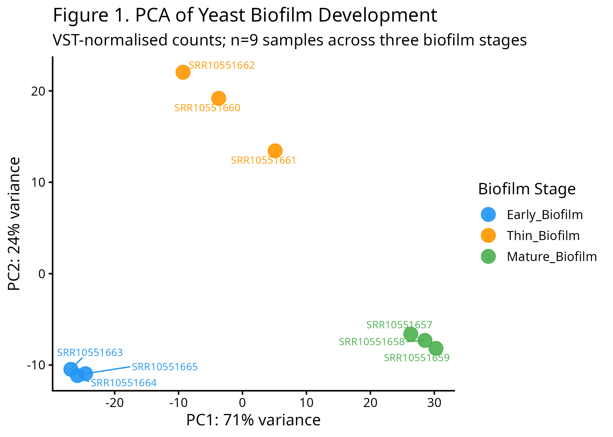
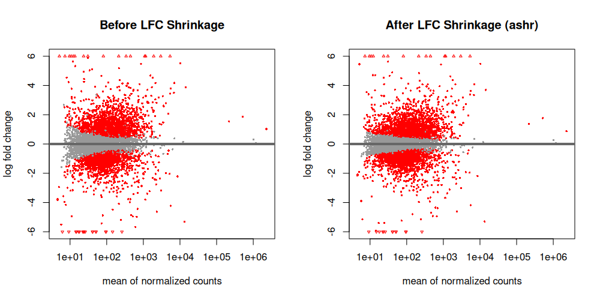
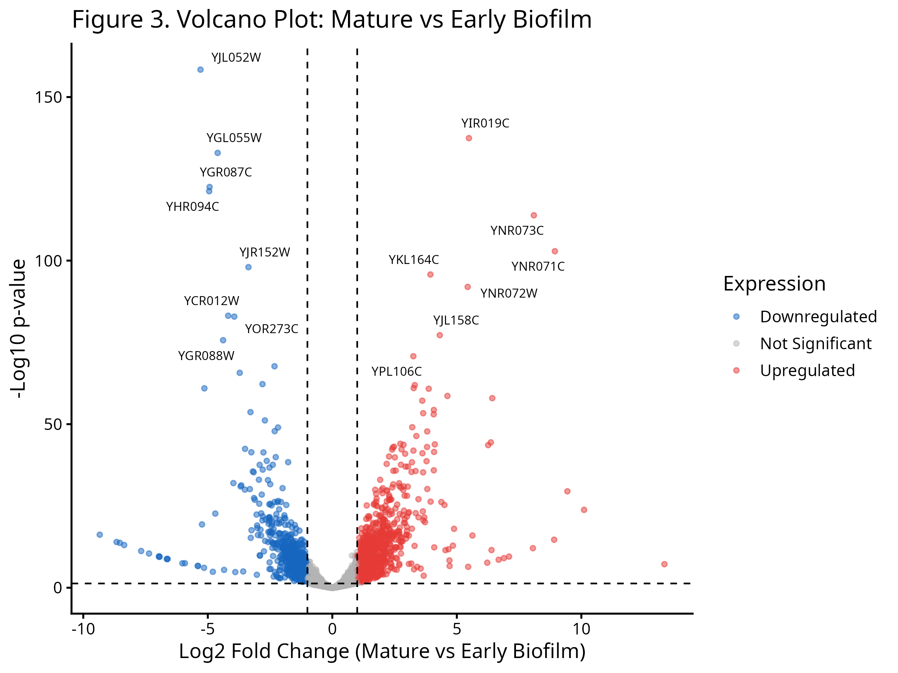
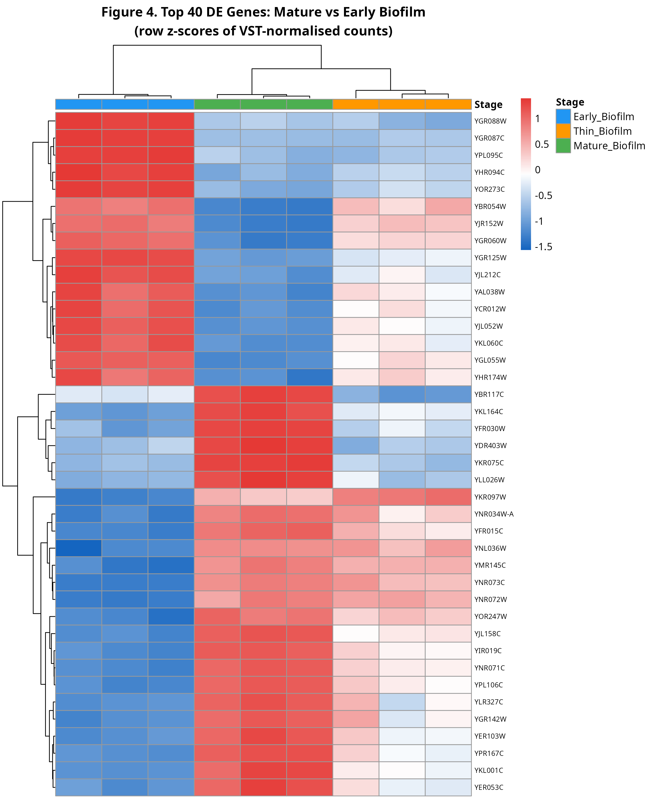
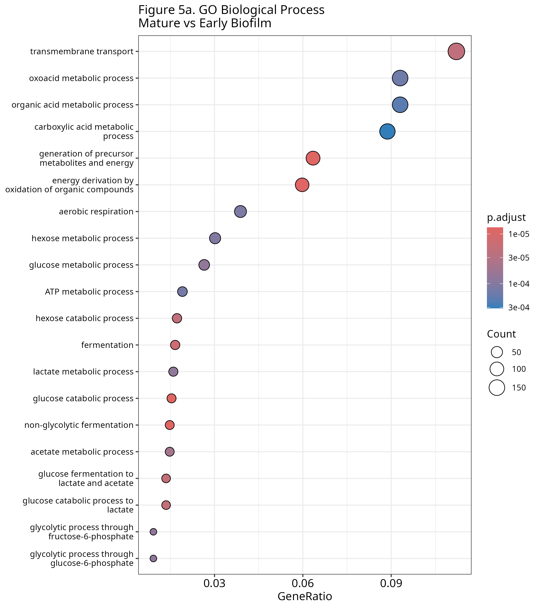
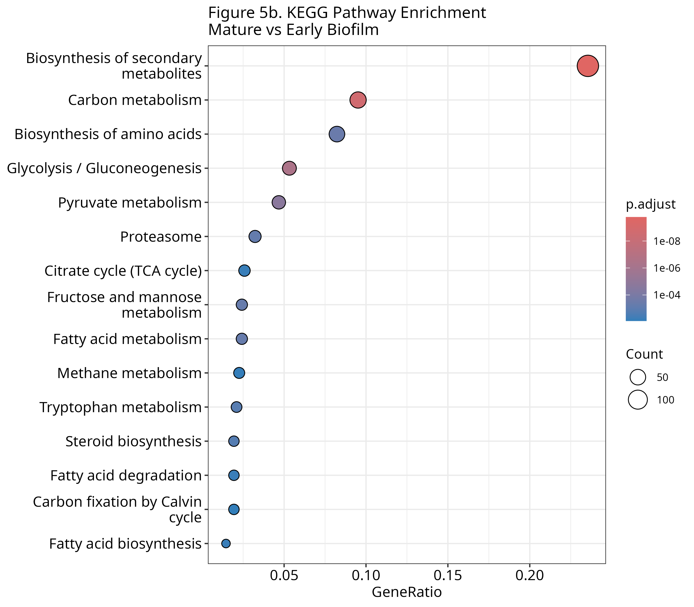
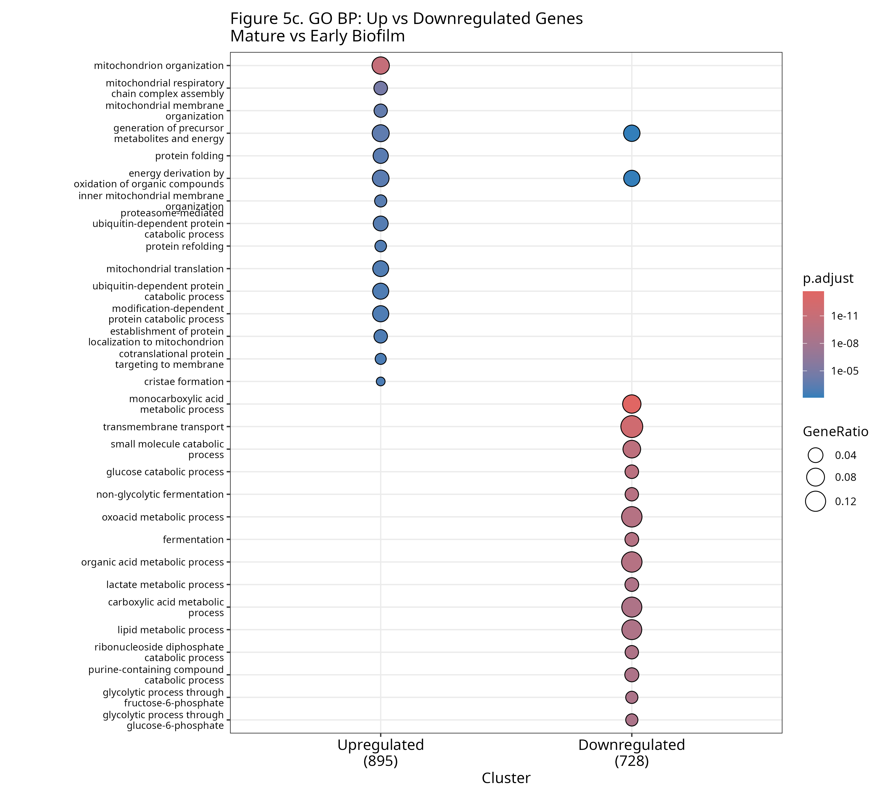

# Yeast Biofilm RNA-seq Analysis
Arwa Sheheryar  
BINF6110 – Assignment 2
---
## Introduction

Biofilms are structured microbial communities encased in a self-produced extracellular matrix that confer coordinated resistance to environmental stressors, including antimicrobials and ethanol (Yang et al., 2018). Their formation has broad medical and industrial relevance. In clinical settings, biofilm-associated tolerance contributes to persistent infections, while in fermentation contexts, biofilm development influences community stability and metabolic output (Yang et al., 2018). In Saccharomyces cerevisiae, biofilm formation (the velum that develops on the surface of aging wine) is largely governed by the FLO gene family, which differentially regulates cell–cell and cell–surface adhesion and makes yeast a strong genetic model for studying adhesion-mediated community behaviour (Bester et al., 2006; Yang et al., 2018). Biofilm maturation represents a biologically distinct phase characterised by increased structural complexity and dynamic remodelling of gene expression, reflecting adaptive responses to changing chemical and nutritional conditions over time (Yang et al., 2018).

RNA-seq is well suited for examining transcriptional dynamics because it enables unbiased, genome-wide quantification of transcript abundance without relying on pre-designed probes (Nookaew et al., 2012). Compared to microarrays, RNA-seq offers a broader dynamic range, allowing more accurate measurement of both low- and high-abundance transcripts and detecting more differentially expressed genes with larger fold changes in S. cerevisiae datasets (Nookaew et al., 2012; Zhao et al., 2014). Its sensitivity to rare and transient transcripts, including cryptic RNAs and alternative isoforms that often fall below array detection thresholds, improves detection of transcriptional complexity in yeast biofilms (Zhao et al., 2014). By avoiding cross-hybridization artifacts, probe saturation, and fixed annotation constraints inherent to microarrays, RNA-seq also provides improved statistical power for detecting differential expression, particularly among lowly expressed and downregulated genes when paired with count-based modeling frameworks (Nookaew et al., 2012).

Read quality was assessed prior to quantification using FastQC (Andrews, 2010), which remains the standard first-pass diagnostic tool for RNA-seq data, evaluating per-base quality scores, GC content, duplication levels, and adapter contamination. Although trimming tools such as Trimmomatic and Cutadapt are widely used to remove low-quality bases and adapter sequences, trimming is not universally beneficial: when libraries are of uniformly high quality and no adapter contamination is detected, aggressive trimming can introduce read length heterogeneity that reduces mapping rates and quantification consistency (Williams et al., 2016). This is particularly relevant for quasi-mapping pipelines such as Salmon, where the k-mer-based matching approach is robust to minor end-of-read quality variation without the need for pre-processing (Patro et al., 2017). Trimming was therefore omitted here following confirmation of high-quality metrics across all nine libraries.

Transcript-level quantification was performed using Salmon v1.10.3 (Patro et al., 2017), which uses selective alignment with a decoy-aware index to reduce spurious mapping to genomic loci. Alternative approaches such as STAR and HISAT2 perform splice-aware genome alignment and require a separate counting step using tools like featureCounts or HTSeq. This two-step workflow is more computationally intensive and, in the case of STAR, can require over 30 GB of RAM for genome indexing (Dobin et al., 2013). These requirements were impractical because analyses were conducted within a Linux virtual machine running in UTM on Apple Silicon with limited available memory. Although HISAT2 is more memory-efficient than STAR, it does not natively produce transcript quantification and requires additional downstream tools, introducing potential variability in count estimates (Kim et al., 2019). Benchmarking studies show that Salmon achieves quantification accuracy comparable to STAR while running faster and using substantially less memory, making it suitable for standard laptop environments (Patro et al., 2017; Srivastava et al., 2019). Salmon also includes GC bias correction and improved handling of multimapping reads, which is particularly relevant for paralogous gene families such as HXT and FLO in S. cerevisiae (Patro et al., 2017). A limitation of single-end sequencing, as used here, is that fragment length distributions must be estimated rather than directly observed, introducing slightly greater uncertainty in transcript-level estimates compared to paired-end data (Patro et al., 2017).

Differential expression analysis was conducted in R using DESeq2 v1.50.2, which models count data with a negative binomial distribution and stabilizes gene-wise dispersion estimates through empirical Bayes shrinkage (Love et al., 2014). Alternative methods such as edgeR and limma-voom also perform well in benchmarking studies (Soneson & Delorenzi, 2013; Schurch et al., 2016), but key differences guided the choice of DESeq2. Although edgeR performs similarly with small replicate numbers, it has been reported to be less conservative for lowly expressed genes relative to DESeq2 (Love, 2016). Limma-voom performs optimally with larger sample sizes, whereas with three replicates per condition, DESeq2’s per-gene dispersion modeling provides more stable variance estimates (Law et al., 2014; Schurch et al., 2016). DESeq2 also integrates directly with tximport, allowing inferential uncertainty from Salmon transcript-level estimates to be propagated to gene-level counts (Soneson et al., 2015). Log2 fold changes were further stabilized using adaptive shrinkage (ashr), which reduces noise from low-count genes without imposing a fixed prior (Stephens, 2017).

To interpret differential expression results functionally, over-representation analysis (ORA) was applied using clusterProfiler. While Gene Set Enrichment Analysis (GSEA) evaluates ranked gene lists and is sensitive to distributed pathway-level shifts (Subramanian et al., 2005), ORA directly tests whether a threshold-defined set of significant genes is enriched for specific GO or KEGG categories (Reimand et al., 2019). Although ORA is sensitive to threshold choice and assumes gene independence (Huang et al., 2009), the use of stringent DESeq2 filtering and separate analyses of up- and downregulated gene sets supports its interpretability and appropriateness for this dataset (Yu et al., 2012; Ziemann et al., 2024).
This study reanalyzes publicly available RNA-seq data from Mardanov et al. (2020) to characterize transcriptional differences across three stages of yeast velum biofilm development: early, thin, and mature at 38, 83, and 109 days post-inoculation. Differential expression was performed with DESeq2, and GO biological process and KEGG pathway enrichment were assessed using ORA to identify biological functions associated with biofilm progression.

---
## Methods

### Data Acquisition:

Raw RNA-seq data were obtained from the NCBI Sequence Read Archive under BioProject accession PRJNA592304 (Mardanov et al., 2020). The dataset comprises nine single-end bulk RNA-seq libraries representing three stages of yeast velum biofilm development: Early Biofilm (IL20–IL22; Day 38), Thin Biofilm (IL23–IL25; Day 83), and Mature Biofilm (IL29–IL31; Day 109), with three biological replicates per stage. Raw reads were downloaded using SRA Toolkit v3.2.1 (fasterq-dump --split-files).

### Quality Control:

Read quality was assessed using FastQC v0.12.1 (Andrews, 2010). All nine samples passed quality thresholds with no adapter contamination detected; trimming was therefore not performed, consistent with recommendations for pseudoalignment-based quantification pipelines (Patro et al., 2017).

### Reference and Quantification:

The Saccharomyces cerevisiae R64 reference transcriptome and genome (GCF_000146045.2) were downloaded from NCBI. A decoy-aware Salmon index was constructed using the full genome sequence as a decoy to prevent spurious mapping of genomic reads to the transcriptome (Patro et al., 2017). Transcript-level quantification was performed using Salmon v1.10.3 with automatic library type detection (-l A), mapping validation (--validateMappings), and GC bias correction (--gcBias). All libraries were processed as single-end reads.

### Differential Expression Analysis:

Transcript-level counts were imported and summarized to gene level using tximport v1.38.2 (Soneson et al., 2015), with a transcript-to-gene mapping table derived from the R64 GTF annotation using txdbmaker. Differential expression analysis was performed in R v4.5.1 using DESeq2 v1.50.2 (Love et al., 2014). A design formula of ~stage was specified, with Early Biofilm set as the reference group. Genes with fewer than 10 counts in fewer than three samples were removed prior to analysis. Three pairwise comparisons were performed: Thin Biofilm vs Early Biofilm, Mature Biofilm vs Early Biofilm, and Mature Biofilm vs Thin Biofilm. Log2 fold changes were regularized using adaptive shrinkage (ashr; Stephens, 2017) to reduce noise from low-count genes. Genes were considered significantly differentially expressed at a Benjamini-Hochberg adjusted p-value < 0.05 and |log2 fold change| > 1. File paths were managed using the here package v1.0.2 to ensure cross-platform reproducibility.

### Functional Annotation:

Over-representation analysis (ORA) was performed using clusterProfiler v4.18.4 (Yu et al., 2012) with the S. cerevisiae annotation database org.Sc.sgd.db v3.22.0. Yeast ORF identifiers were mapped to Entrez Gene IDs using bitr(). GO Biological Process enrichment was tested for the full set of significant DE genes, as well as separately for upregulated and downregulated subsets using compareCluster(). KEGG pathway enrichment was performed using enrichKEGG() with organism code "sce". For all ORA analyses, the background set comprised all genes detected after pre-filtering, Benjamini-Hochberg correction was applied, and significance thresholds of p-adjusted < 0.05 and q-value < 0.2 were used.

---
## Results

### Data Quality and Overall Transcriptional Structure

Quality assessment using FastQC v0.12.1 confirmed that all nine libraries met
acceptable quality thresholds, with no adapter contamination or substantial quality
degradation detected across any sample; trimming was therefore not performed.
Principal component analysis of variance-stabilized counts revealed clear
transcriptional separation among the three biofilm stages (Figure 1). PC1,
accounting for 71% of total variance, separated Early Biofilm samples from Thin
and Mature Biofilm samples, while PC2 (24% variance) further resolved the Thin
and Mature stages. Biological replicates clustered tightly within each group,
demonstrating high within-group reproducibility and confirming that biofilm
developmental stage is the dominant source of transcriptional variation in this
dataset.

**Figure 1.** Principal component analysis of VST-normalised RNA-seq counts across
nine yeast biofilm samples. Each point represents one biological replicate, coloured
by biofilm stage. PC1 (71% variance) separates Early Biofilm from later stages;
PC2 (24% variance) resolves Thin and Mature Biofilm.

MA plots comparing normalized mean expression against log2 fold change before and
after shrinkage confirmed that adaptive shrinkage (ashr) effectively reduced
inflated fold changes associated with low-count genes while preserving large,
reliable fold changes at higher expression levels (Figure 2).

**Figure 2.** MA plots showing log2 fold change versus mean normalized counts before
(left) and after (right) adaptive shrinkage (ashr) for the Mature vs Early Biofilm
comparison. Red points indicate statistically significant genes.

---

### Differential Expression Analysis

Pairwise differential expression analysis identified substantial transcriptional
remodeling across all three stage comparisons (padj < 0.05, |log2FC| > 1).
Comparing Thin Biofilm to Early Biofilm, 794 genes were differentially expressed,
of which 410 were upregulated and 384 were downregulated. The largest
transcriptional changes were observed in the Mature vs Early Biofilm comparison,
yielding 1,625 differentially expressed genes (896 upregulated, 729 downregulated),
consistent with the substantial elapsed time between these stages (38 to 109 days
post-inoculation). The Mature vs Thin Biofilm comparison identified 968
differentially expressed genes (575 upregulated, 393 downregulated), indicating
continued transcriptional remodeling beyond the thin biofilm stage.

The volcano plot for the Mature vs Early comparison illustrates the broad and
symmetric distribution of fold changes, with a subset of genes exhibiting both
high statistical significance and large effect sizes (Figure 3). Among the most
significantly differentially expressed genes were YGR088W, YGR087C, YHR094C,
YOR273C, YJL052W, YNR073C, YNR071C, YNR072W, YIR019C, and YPL106C.

**Figure 3.** Volcano plot of differential gene expression between Mature and Early
Biofilm. Each point represents one gene; red = significantly upregulated
(padj < 0.05, log2FC > 1), blue = significantly downregulated, grey = not
significant. Dashed lines indicate thresholds at |log2FC| = 1 and padj = 0.05.
The 15 most significant DE genes are labelled.

Hierarchical clustering of the top 40 most significantly DE genes confirmed that
Mature Biofilm replicates form a distinct expression cluster relative to Early
Biofilm samples, with Thin Biofilm samples occupying an intermediate position,
consistent with a progressive transcriptional program unfolding across biofilm
development (Figure 4).

**Figure 4.** Heatmap of the top 40 differentially expressed genes (Mature vs Early
Biofilm, ranked by adjusted p-value). Values represent row z-scores of
VST-normalised counts. Columns are annotated by biofilm stage.

---

### Functional Annotation and Pathway Enrichment

Over-representation analysis of GO Biological Process terms among the 1,625
significantly DE genes in the Mature vs Early comparison revealed strong enrichment
of metabolic and transport processes (Figure 5a). The most significantly enriched
terms included transmembrane transport, oxoacid metabolic process, organic acid
metabolic process, carboxylic acid metabolic process, and generation of precursor
metabolites and energy, alongside carbon catabolism processes including
fermentation, glucose catabolic process, hexose catabolic process, and
non-glycolytic fermentation.

**Figure 5a.** GO Biological Process over-representation analysis for significantly
differentially expressed genes in the Mature vs Early Biofilm comparison
(padj < 0.05, |log2FC| > 1). Dot size represents gene count; colour indicates
adjusted p-value.

KEGG pathway enrichment corroborated these findings, with the top enriched pathways
including biosynthesis of secondary metabolites, carbon metabolism, biosynthesis of
amino acids, glycolysis/gluconeogenesis, pyruvate metabolism, and the citrate cycle
(TCA cycle), as well as proteasome and fatty acid metabolism pathways (Figure 5b).

**Figure 5b.** KEGG pathway over-representation analysis for the Mature vs Early
Biofilm comparison. Dot size represents gene count; colour indicates adjusted
p-value.

Directional decomposition of the enrichment signal using `compareCluster()`
revealed a striking functional divergence between upregulated and downregulated
gene sets (Figure 5c). Upregulated genes in the Mature Biofilm were enriched for
mitochondrion organization, mitochondrial respiratory chain complex assembly,
mitochondrial membrane organization, protein folding, and ubiquitin-dependent
protein catabolic processes. In contrast, downregulated genes were enriched for
fermentative and glycolytic processes including monocarboxylic acid metabolic
process, transmembrane transport, non-glycolytic fermentation, glucose catabolic
process, and lipid metabolic process. This divergent enrichment pattern is
consistent with a broad metabolic shift from fermentation toward respiratory
metabolism as the biofilm matures.

**Figure 5c.** Comparative GO Biological Process enrichment for upregulated
(n = 895) and downregulated (n = 728) gene sets in the Mature vs Early Biofilm
comparison. Upregulated genes are enriched for mitochondrial and proteostatic
processes; downregulated genes are enriched for fermentation and glycolytic
processes.

---
## Discussion

Transcriptomic profiling of S. cerevisiae velum biofilm development (Mardanov et al., 2020; PRJNA592304) revealed 895 upregulated and 728 downregulated genes in the mature versus early stage, indicating widespread reprogramming across two dominant themes: metabolic adaptation to nutrient limitation and reinforcement of cell surface architecture characteristic of a mature biofilm.

FLO11 drives mature biofilm adhesion

The most statistically significant upregulated gene was FLO11 (YIR019C; log2FC = +5.49, padj = 1.0 × 10⁻¹³⁴), encoding a GPI-anchored mucin-like flocculin essential for pseudohyphal growth, invasive growth, and biofilm formation. FLO11 is the principal surface adhesin mediating cell-to-substrate and cell-to-cell interactions in S. cerevisiae biofilms, and its induction is regulated by both the MAPK and cAMP/PKA signalling pathways (Guo et al., 2000). Its strong upregulation here is consistent with the structural demands of a mature velum biofilm, which requires robust adhesive interconnections between cells. Modest but significant upregulation of FLO10 (YKL185W; log2FC = +1.66) and YBR038W (log2FC = +1.71) from the broader FLO family supports a coordinated flocculin-mediated programme, though FLO11 appears to be the dominant effector in this system.

Downregulation of glycolysis and fermentation

Several of the most significantly downregulated genes encode core glycolytic enzymes. TDH1 (YJL052W; log2FC = −5.29, padj = 2.3 × 10⁻¹⁵⁵) encodes GAPDH isozyme 1, catalysing the conversion of glyceraldehyde-3-phosphate to 1,3-bisphosphoglycerate, while PGK1 (YCR012W; log2FC = −4.18) encodes phosphoglycerate kinase. Downregulation of these central glycolytic enzymes is reinforced by GO enrichment analysis showing strong enrichment for "glucose catabolic process," "glycolytic process," "fermentation," and "monocarboxylic acid metabolic process" among downregulated genes (Figure 5c). KEGG enrichment identified Glycolysis/Gluconeogenesis and Pyruvate metabolism as top pathways (Figure 5b). Together, these findings indicate a diauxic-like metabolic contraction in mature biofilm, consistent with glucose depletion within the biofilm microenvironment over time. ADH4 (YJR152W; log2FC = −3.37), which encodes a fermentative alcohol dehydrogenase active under anaerobic conditions, was also significantly downregulated, further supporting a shift away from fermentation.

Glucose sensing and HXT1 repression

HXT1 (YHR094C; log2FC = −4.94), encoding the low-affinity, high-capacity glucose transporter, was among the most significantly repressed genes. HXT1 expression is known to be induced by glucose abundance and repressed when glucose is limiting (Theodoris et al., 1994), making its downregulation in mature biofilm consistent with nutrient depletion. Theodoris et al. demonstrated that HXT gene expression is dynamically regulated by glucose availability through SNF3 and regulatory elements in HXT promoters, and that different HXT family members are adapted to distinct environmental conditions. The repression of HXT1 alongside other glycolytic genes thus likely reflects a physiological glucose-sensing response as the biofilm matures and nutrient availability declines. Furthermore, HXT1 resides within the HXT5–HXT1–HXT4 tandem gene cluster on chromosome VIII, a region Choi et al. (2020) showed is prone to spontaneous recombination via single-strand annealing, which could contribute additional regulatory complexity at this locus during biofilm development.

Membrane lipid remodelling 

OLE1 (YGL055W; log2FC = −4.60), encoding the delta-9 stearoyl-CoA desaturase responsible for introducing unsaturation into fatty acid chains, was significantly downregulated. OLE1 is the sole desaturase in S. cerevisiae and is essential for maintaining appropriate membrane fluidity. Its downregulation, alongside enrichment of "lipid metabolic process" and "fatty acid biosynthesis" in the downregulated gene set, suggests altered membrane composition in mature biofilm, which may affect signalling and cell wall integrity. OLE1 is also known to influence invasive growth (Kwast et al., 1999), potentially linking membrane remodelling to the filamentous growth phenotypes associated with biofilm.

Mitochondrial upregulation

Compensating for the decline in fermentation, upregulated genes were strongly enriched for mitochondrial functions including "mitochondrion organization," "mitochondrial respiratory chain complex assembly," and "generation of precursor metabolites and energy" (Figure 5c). This signature indicates a shift to respiration, consistent with post-diauxic phase biology, and mirrors observations from the original study of this velum biofilm dataset (Mardanov et al., 2020).
Taken together, the transcriptional programme of mature S. cerevisiae velum biofilm reflects a coherent biological strategy: downregulation of fermentation and glucose import as nutrients deplete, upregulation of respiratory metabolism, remodelling of membrane lipid composition, and strong induction of cell surface adhesins, particularly FLO11 to maintain the structural integrity of the mature biofilm.

---
## Reproducibility

All code is available in the project GitHub repository (https://github.com/arwasheheryar/BINF6110-A2) under scripts/. The full conda environment specification is provided in scripts/environment.yml and can be recreated with conda env create -f scripts/environment.yml.

## References
Andrews, S. (2010). FastQC: A quality control tool for high throughput sequence data.

Bester, M. C., Pretorius, I. S., & Bauer, F. F. (2006). The regulation of Saccharomyces cerevisiae FLO gene expression and its role in yeast biofilm formation. Archives of Microbiology, 186(2), 99–111. 

DeRisi, J. L., Iyer, V. R., & Brown, P. O. (1997). Exploring the metabolic and genetic control of gene expression on a genomic scale. Science, 278(5338), 680–686.

Love, M. I., Huber, W., & Anders, S. (2014). Moderated estimation of fold change and dispersion for RNA-seq data with DESeq2. Genome Biology, 15(12), 550.

Nookaew, I., Papini, M., Pornputtapong, N., Scalcinati, G., & Nielsen, J. (2012). A comprehensive comparison of RNA-seq and microarray technologies for transcriptome analysis in Saccharomyces cerevisiae. BMC Genomics, 13, 621.

Patro, R., Duggal, G., Love, M. I., Irizarry, R. A., & Kingsford, C. (2017). Salmon provides fast and bias-aware quantification of transcript expression. Nature Methods, 14(4), 417–419.

Reimand, J., Isserlin, R., Voisin, V., Kucera, M., Tannus-Lopes, C., Rostamianfar, A., Wadi, L., Meyer, M., Wong, J., Xu, C., Merico, D., & Bader, G. D. (2019). Pathway enrichment analysis and visualization of omics data using g:Profiler, GSEA, Cytoscape and EnrichmentMap. Nature Protocols, 14(2), 482–517. 

Soneson, C., Love, M. I., & Robinson, M. D. (2015). Differential analyses for RNA-seq: transcript-level estimates improve gene-level inferences. F1000Research, 4, 1521.

Stephens, M. (2017). False discovery rates: a new deal. Biostatistics, 18(2), 275–294.

Yang, Y., Guo, Z., & Wang, X. (2018). The regulatory network of Saccharomyces cerevisiae biofilm formation. Frontiers in Microbiology, 9, 1860.

Yoon, S., Kim, S.-Y., & Nam, D. (2016). Improving gene-set enrichment analysis of RNA-seq data with small replicates. PLOS ONE, 11(11), e0165919. 

Yu, G., Wang, L.-G., Han, Y., & He, Q.-Y. (2012). clusterProfiler: an R package for comparing biological themes among gene clusters. OMICS, 16(5), 284–287.

Zhao, S., Fung-Leung, W.-P., Bittner, A., Ngo, K., & Liu, X. (2014). Comparison of RNA-Seq and microarray in transcriptome profiling of activated T cells. PLoS ONE, 9(1), e78644.

Ziemann, M., Schroeter, B., & Bora, A. (2024). Two subtle problems with overrepresentation analysis. Bioinformatics Advances, 4(1), vbae159. 

